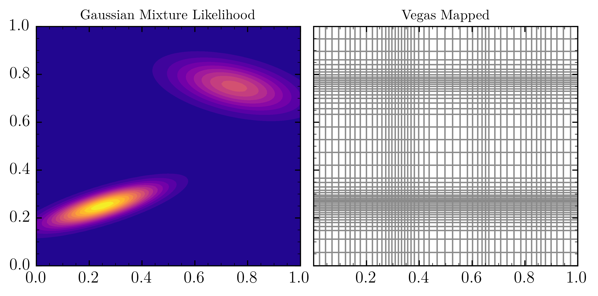
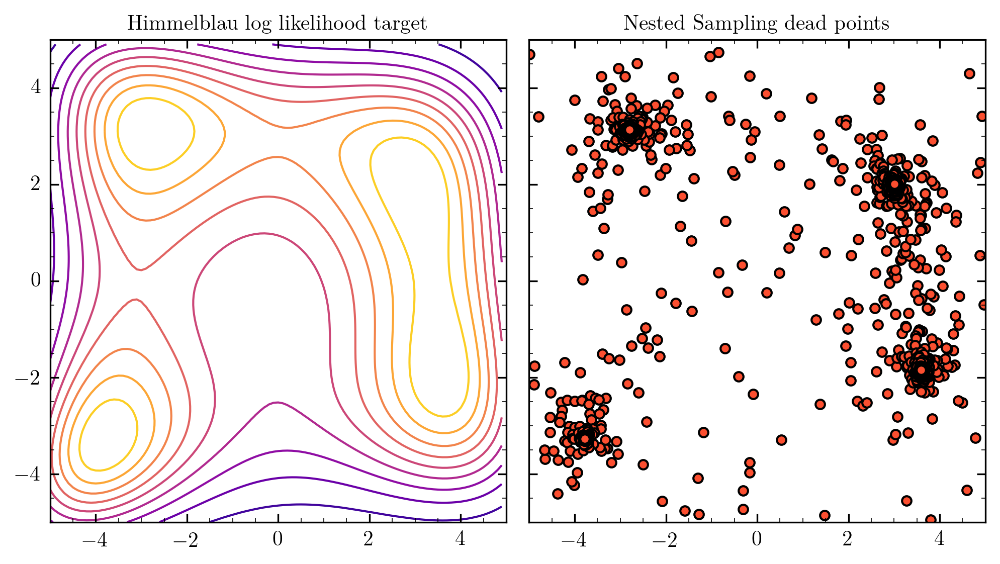
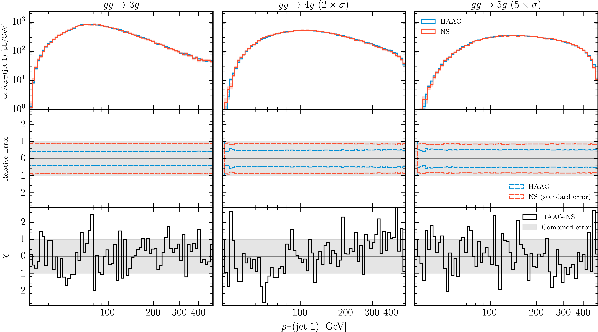

<!-- _class: invert lead-->

# Exploring Phase Space with Nested Sampling

### David Yallup (<dy297@cam.ac.uk>)

Work based on [[2205.02030]](https://arxiv.org/abs/2205.02030) w. T. Janßen, S. Schumann, W. Handley
&nbsp;
&nbsp;
###### _Bayesian Inference in High Energy Physics, Durham University_
 
###### 25-27th May 2022

 

----

<!-- paginate: true -->
<!-- #footer: Exploring phase space with Nested Sampling  -->

### Exploring phase space?
&nbsp;

$$ \sigma = \int\limits_\Omega d\Phi |\mathcal{M}|^2 (\Phi)\, $$

Cross section  = integral$_\text{(over kinematic variables)}$ ( Matrix Element )
&nbsp;

Central challenge for many physics tasks:  
  

- Total cross section $(\sigma)$ - Probability of process occuring
- Differential cross section $(d\sigma)$ - chunk integral into $d\Phi$ pieces
- Events - (unweight) and use as pseudo data

----
#### Workhorse in HEP on this set of problems is Importance Sampling

- Replace problem of sampling from unknown $P(\Phi)$ with a known $Q(\Phi)$
- Adjust importance of sample drawn from $Q$ by weighting, $w=\frac{P(\Phi)}{Q(\Phi)}$

----

#### Problem seemingly reduces to coming up with good mappings for target
&nbsp;

However, Even in $D=\mathcal{O}(10)$ Dimensions this starts to break. 
- Massless glue scattering, $D=3n_g-4$:
  - $gg\rightarrow 3g$, $D=5$
  - $gg\rightarrow 4g$, $D=8$

Even modern ML (normalising flows) won't save you [[2001.05478]](https://arxiv.org/abs/2001.05478)

Algorithm | Efficiency $gg\rightarrow 3g$ | Efficiency $gg\rightarrow 4g$ 
-----|:-----:|:-----:
HAAG | 3.0% | 2.7% 
Vegas | 27.7% | 31.8% 
Neural Network | 64.3% | 33.6% 

----

## A sampling problem? Anyone for MCMC?

Central problem:
- Convergent integral means you have good posterior samples
- __Reverse not true__, Samples from a convergent MCMC chain __not__ guaranteed a good integral
- Multimodal targets well established failure mode.
  - Multichannel decompositions in MCMC HEP, (MC)$^3$ [[1404.4328]](https://arxiv.org/abs/1404.4328)

$$P(\Phi ) = \frac{ \mathcal{L}(\Phi) \Pi (\Phi)}{\mathcal{Z}} \propto \mathcal{L}(\Phi) \Pi (\Phi) $$
&nbsp;

_MCMC kicks in as we go to high dimensions, grey area between IS and MCMC, can ML help?_

----
## Where's the Evidence?

In neglecting the Evidence ($\mathcal{Z}$) we have neglected precisely the quantity we want,

$$ \sigma = \int\limits_\Omega d\Phi |\mathcal{M}|^2 (\Phi)\, $$
$$ \mathcal{Z} = \int d\theta \mathcal{L} (\theta) \Pi (\theta)\, $$

- Mapping $\rightarrow$ Prior
- Matrix element $\rightarrow$ Likelihood
- Cross section $\rightarrow$ Evidence

----
## Nested Sampling

Nested Sampling [[Skilling 2006]](https://projecteuclid.org/journals/bayesian-analysis/volume-1/issue-4/Nested-sampling-for-general-Bayesian-computation/10.1214/06-BA127.full), implemented for in PolyChord [[1506.00171]](https://arxiv.org/abs/1506.00171). Is a good way to generically approach this problem for $\mathcal{O}(10)\rightarrow \mathcal{O}(100)$ dimensions

- Primarily an integral algorithm (largely unique vs other MCMC approaches)

- Designed for multimodal problems from inception 

- Requires construction that can sample under hard likelihood constraint

- Largely self tuning

  - Little interal hyperparameterization
  - More importantly, tunes any reasonable prior to posterior

----
<!-- _class: invert lead-->

[[yallup.github.io/bayeshep_durham]](https://yallup.github.io/bayeshep_durham/) for animated versions

----
<!-- _class: invert lead-->

----
<!-- _class: invert lead-->

----
<!-- _class: invert lead-->

Unweighted Events 

----
<!-- _class: invert lead-->

Algorithm |  $gg\rightarrow 3g$ |  $gg\rightarrow 4g$  |  $gg\rightarrow 5g$
-----|:-----:|:-----: |:-----:
HAAG | 3.0% | 2.7% | 2.8%
Vegas (cold start) | 2.0% | 0.05% | 0.01% 
NS | 1.0% | 1.0% | 1.0%  

----

## Where do we go from here?

End to end stylised version of the problem demonstrated. 

This is deeper than coming up with a new way of mapping phase space

----

## Where do we go from here? 
(dedicated section in paper)

- _Physics challenges_

- Variants of NS algorithm

- Prior information

- Fitting this together with modern ML

----

## Physics challenges

The fundamental motivation for this work came from recognising not just an ML challenge but a physics challenge [[2004.13687]](https://arxiv.org/abs/2004.13687)

LO dijet isn't hard, NNNLO is. If your method isn't robust in these limits it doesn't solve the right problem. Unique features of NS open up interesting physics:

- __No mapping required:__ NLO proposals generically harder, NNLO more so 
- __No channel decomposition:__ can we be _really_ clever when it comes to counter events, negative events etc. with this?
- __Computation scaling guaranteed__ to $\sim$ polynomial with $D$, other methods exponential: We can do _genuinely_ high dimensional problems, $gg\rightarrow 10g$ anyone?

----
## Conclusion

In my opinion (your milage may vary)
<!-- Event generation is a Markov Chain sampling process (despite what you may have been told), needing stochastic refinement is inevitable. -->

<!-- Event Generation is fundamentally an inversion of a Conditional probability, Bayesian inference (and hence Markov Chains) are the (IMO) proper language for this problem -->

- The fundamental problem for LHC event generation trying to do Importance Sampling in high dimension.

- Machine learning can and will be useful, but this is not __just__ a machine learning mapping problem. 

- This __is__ a Bayesian inference problem, precisely calculating Evidences or Posterior sampling. 

- Nested Sampling is a high dimensional integration method, primarily from Bayesian Inference, that is an excellent choice for particle physics integrals

